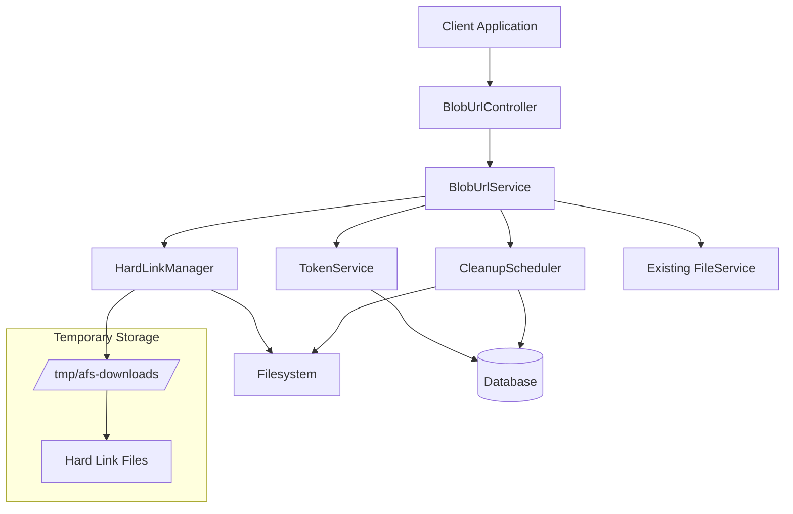

# Design Document

## Overview

This design implements a blob URL system for the Advanced File Server (AFS) that creates temporary download URLs using filesystem hard links. The system integrates with the existing Spring Boot architecture, leveraging the current FileService and controller patterns while adding new components for temporary URL management, hard link creation, and automatic cleanup.

The solution provides instant URL generation regardless of file size by creating hard links instead of copying files, maintaining security through cryptographically secure tokens, and ensuring proper cleanup of temporary resources.

## Architecture

### High-Level Architecture



### Integration with Existing Architecture

The blob URL system integrates seamlessly with the existing AFS architecture:

- **Controllers**: New `BlobUrlController` follows existing controller patterns from `FileController`
- **Services**: New `BlobUrlService` integrates with existing `FileService` for file validation
- **Security**: Leverages existing Spring Security configuration and JWT authentication
- **Database**: Uses existing JPA/Hibernate setup with new entities for URL tracking
- **Configuration**: Extends existing `application.yml` configuration patterns

## Components and Interfaces

### 1. BlobUrlController

**Responsibility**: REST API endpoints for blob URL operations

**Key Methods**:
- `POST /blob-urls/create` - Create temporary download URL
- `GET /blob-urls/{token}/status` - Check URL status and metadata
- `GET /downloads/{token}` - Download file via temporary URL

**Integration**: Follows existing controller patterns, uses same security annotations and error handling as `FileController`

### 2. BlobUrlService

**Responsibility**: Core business logic for blob URL management

**Key Methods**:
- `createBlobUrl(String filePath)` - Creates hard link and returns URL info
- `getBlobUrlStatus(String token)` - Returns URL status and metadata
- `validateAndGetFile(String token)` - Validates token and returns file for download
- `cleanupExpiredUrls()` - Removes expired URLs and hard links

**Dependencies**:
- `FileService` - For file validation and metadata
- `HardLinkManager` - For filesystem operations
- `TokenService` - For secure token generation
- `BlobUrlRepository` - For URL persistence

### 3. HardLinkManager

**Responsibility**: Filesystem hard link operations with cross-platform support

**Key Methods**:
- `createHardLink(Path source, Path target)` - Creates hard link
- `deleteHardLink(Path target)` - Removes hard link
- `validateFilesystemSupport()` - Checks hard link capability
- `isOnSameFilesystem(Path source, Path target)` - Validates filesystem compatibility

**Platform Support**:
- Linux: Uses `Files.createLink()` with native filesystem calls
- Windows: Uses NTFS hard link support via `Files.createLink()`
- Error handling for unsupported filesystems

### 4. TokenService

**Responsibility**: Secure token generation and validation

**Key Methods**:
- `generateSecureToken()` - Creates cryptographically secure random token
- `validateToken(String token)` - Validates token format and existence
- `isTokenExpired(BlobUrl blobUrl)` - Checks expiration status

**Security Features**:
- 256-bit cryptographically secure random tokens
- URL-safe Base64 encoding
- No predictable patterns or sequential generation

### 5. CleanupScheduler

**Responsibility**: Automatic cleanup of expired resources

**Key Methods**:
- `@Scheduled cleanupExpiredUrls()` - Periodic cleanup task
- `cleanupOnStartup()` - Startup cleanup for orphaned files
- `forceCleanup(String token)` - Manual cleanup for specific URL

**Cleanup Strategy**:
- Runs every 15 minutes (configurable)
- Removes database entries first, then hard links
- Handles cleanup failures gracefully with logging
- Startup cleanup for system recovery

## Data Models

### BlobUrl Entity

```java
@Entity
@Table(name = "blob_urls")
public class BlobUrl {
    @Id
    private String token;           // Primary key, secure random token
    
    @Column(nullable = false)
    private String originalPath;    // Path to original file
    
    @Column(nullable = false)
    private String hardLinkPath;    // Path to hard link file
    
    @Column(nullable = false)
    private String filename;        // Original filename for downloads
    
    @Column(nullable = false)
    private String contentType;     // MIME type for proper headers
    
    @Column(nullable = false)
    private Long fileSize;          // File size in bytes
    
    @Column(nullable = false)
    private LocalDateTime createdAt; // Creation timestamp
    
    @Column(nullable = false)
    private LocalDateTime expiresAt; // Expiration timestamp
    
    @Column(nullable = false)
    private String createdBy;       // User who created the URL
}
```

### BlobUrlResponse DTO

```java
public class BlobUrlResponse {
    private String downloadUrl;     // Full URL for downloading
    private String token;           // Token for status checking
    private String filename;        // Original filename
    private Long fileSize;          // File size in bytes
    private String contentType;     // MIME type
    private LocalDateTime expiresAt; // Expiration time
    private String status;          // "active", "expired", "invalid"
}
```

### Configuration Properties

```java
@ConfigurationProperties(prefix = "afs.blob-urls")
public class BlobUrlProperties {
    private String tempDirectory = "/tmp/afs-downloads";
    private Duration defaultExpiration = Duration.ofHours(1);
    private Duration cleanupInterval = Duration.ofMinutes(15);
    private boolean validateFilesystemOnStartup = true;
    private long maxConcurrentUrls = 1000;
}
```

## Error Handling

### Error Scenarios and Responses

1. **File Not Found**
   - HTTP 404: Original file doesn't exist or not accessible
   - Response: `{"error": "FILE_NOT_FOUND", "message": "File not found or not accessible"}`

2. **Filesystem Not Supported**
   - HTTP 500: Hard links not supported on filesystem
   - Response: `{"error": "FILESYSTEM_UNSUPPORTED", "message": "Hard links not supported on this filesystem"}`

3. **Cross-Filesystem Error**
   - HTTP 400: Source and temp directory on different filesystems
   - Response: `{"error": "CROSS_FILESYSTEM", "message": "Cannot create hard link across filesystems"}`

4. **Token Expired/Invalid**
   - HTTP 404: Token not found or expired
   - Response: `{"error": "TOKEN_INVALID", "message": "Download URL is invalid or expired"}`

5. **Hard Link Creation Failed**
   - HTTP 500: Filesystem error during hard link creation
   - Response: `{"error": "LINK_CREATION_FAILED", "message": "Failed to create temporary download link"}`

### Error Handling Strategy

- All errors logged with appropriate levels (WARN for client errors, ERROR for system errors)
- Consistent error response format across all endpoints
- Graceful degradation with proper HTTP status codes
- Security consideration: Don't expose internal file paths in error messages

## Testing Strategy

### Unit Tests

1. **BlobUrlService Tests**
   - Token generation and validation
   - URL creation with various file types and sizes
   - Expiration handling and cleanup logic
   - Error scenarios (file not found, filesystem errors)

2. **HardLinkManager Tests**
   - Hard link creation and deletion
   - Cross-platform compatibility testing
   - Filesystem validation logic
   - Error handling for unsupported operations

3. **TokenService Tests**
   - Secure token generation (uniqueness, randomness)
   - Token validation logic
   - URL-safe encoding verification

4. **CleanupScheduler Tests**
   - Scheduled cleanup execution
   - Startup cleanup functionality
   - Orphaned file detection and removal

### Integration Tests

1. **Controller Integration Tests**
   - Full API workflow: create URL → download file → cleanup
   - Authentication and authorization testing
   - Error response validation
   - Concurrent access testing

2. **Database Integration Tests**
   - Entity persistence and retrieval
   - Transaction handling during cleanup
   - Database constraint validation

3. **Filesystem Integration Tests**
   - Hard link operations on test filesystem
   - Cleanup verification (files actually removed)
   - Cross-platform testing (Linux/Windows)

### Performance Tests

1. **Load Testing**
   - Concurrent URL creation (target: 100 concurrent requests)
   - Download performance with multiple simultaneous downloads
   - Cleanup performance with large numbers of expired URLs

2. **Storage Testing**
   - Hard link creation speed vs file size
   - Filesystem space usage verification
   - Memory usage during high-volume operations

### Security Tests

1. **Token Security**
   - Token predictability analysis
   - Brute force resistance testing
   - Token collision probability verification

2. **Access Control**
   - Unauthorized access attempts
   - Token sharing between users
   - Path traversal attack prevention